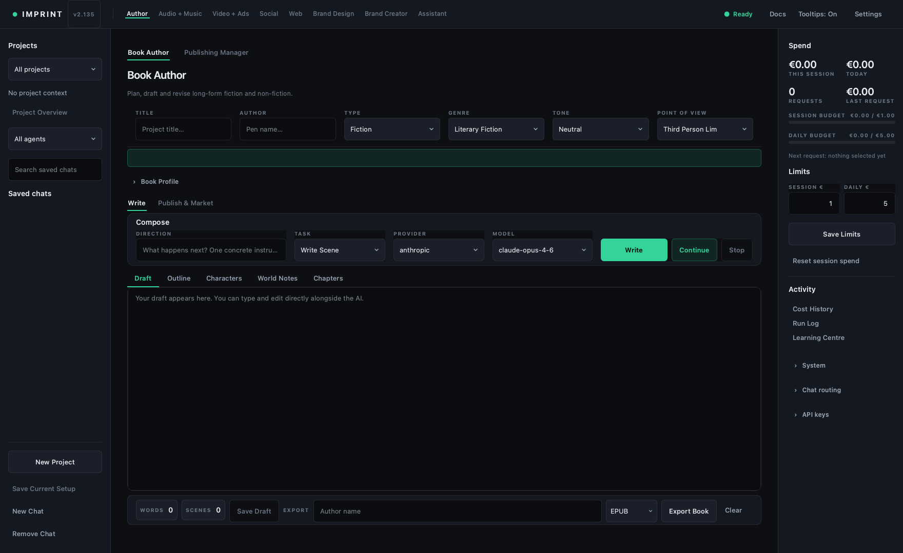
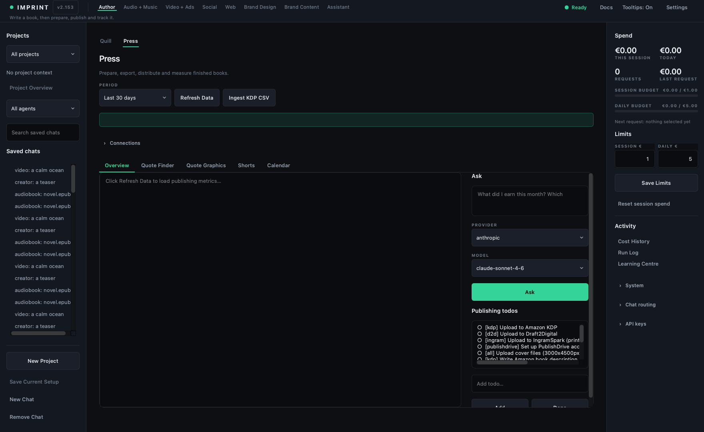
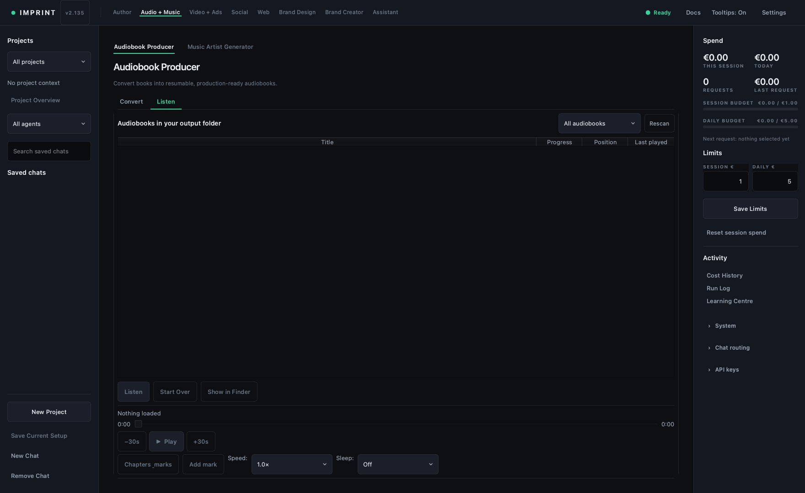
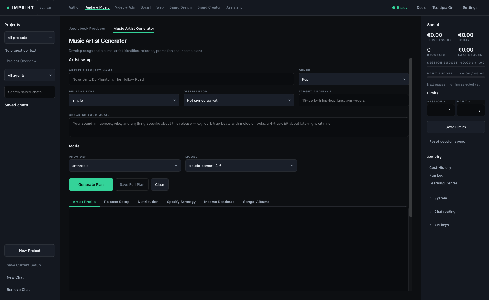
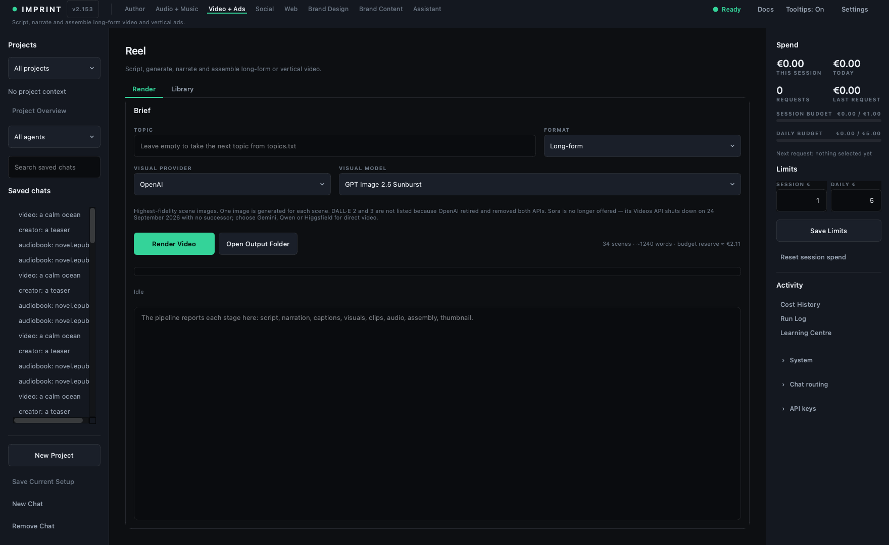
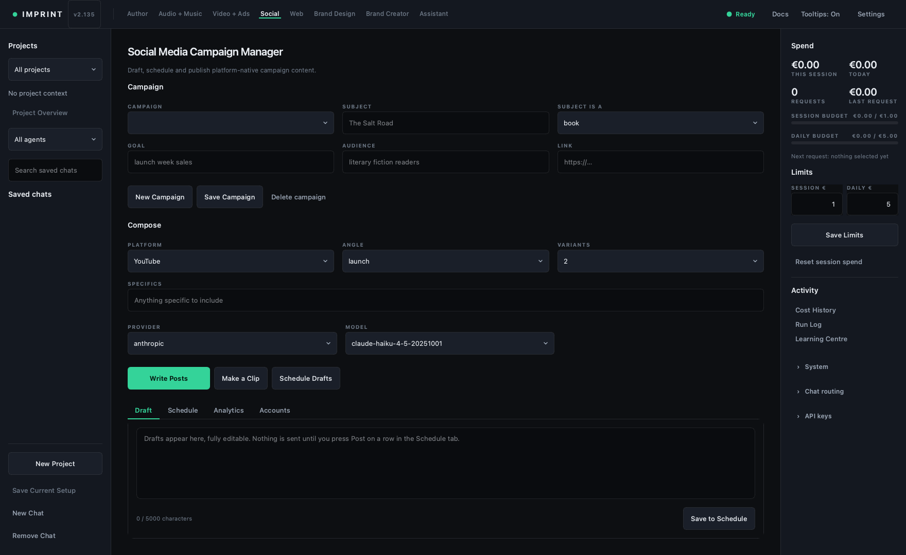
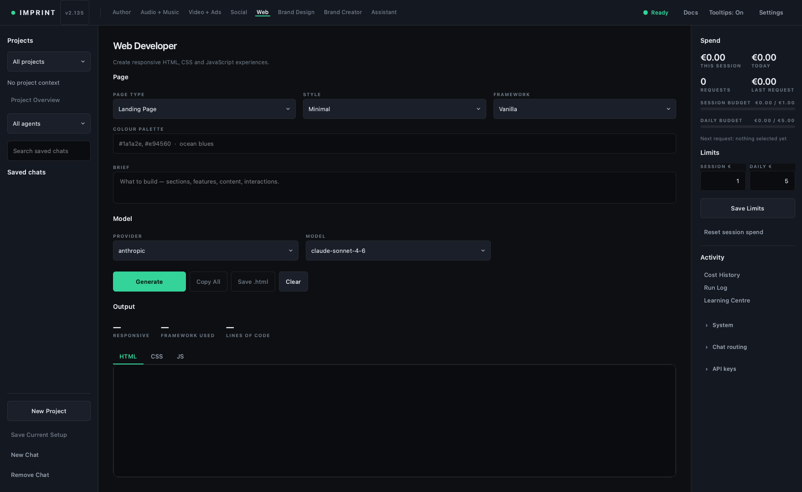
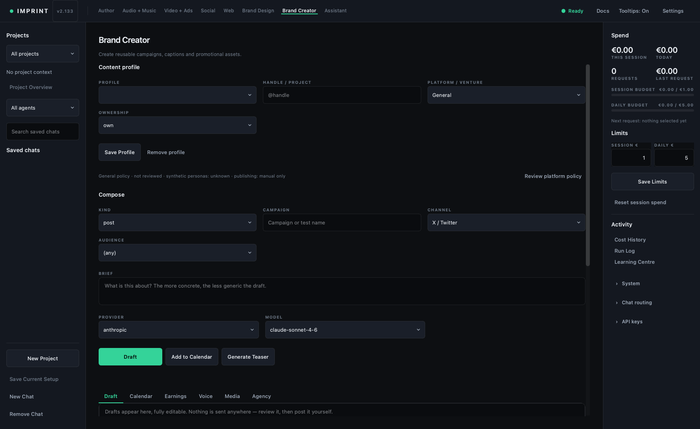

# 2 · Controls & agents

> **Use this page as the field manual.** Search for the label you see on
> screen. Each entry explains what it changes, when to use it, and the failure
> it prevents.

Imprint has eight workspaces and ten operating agents. A workspace describes
the kind of work; an agent owns a specific job. The same model can be excellent
at drafting and poor at image generation, so menus show only providers with a
real execution path for that action.

## Controls that appear throughout Imprint

| Control | What it does | Best use |
|---|---|---|
| **New Project** | Creates a separate saved context. | One project per sellable output or client order. |
| **Workspace tabs** | Moves between Write, Audio, Video, Social, Web, Gigs, Creator, and Venture. | Start from the business stage, not the model name. |
| **Provider** | Selects the service account that receives the request. | Choose for privacy, price, capability, or reliability. |
| **Model** | Selects a model exposed by that provider. | Use the recommended model until a comparison proves a better route. |
| **Refresh Models** | Re-reads selectable models and availability. | Use after changing keys, permissions, or provider configuration. |
| **Get Muse Glimmer** | Retrieves an available Muse Glimmer route when supported. | Use when you want that model family and it is not yet configured. |
| **Model Guide** | Explains model strengths and trade-offs. | Check before paying for a stronger model “just in case.” |
| **Docs** | Opens the technical sheet for the current agent. | Use for requirements, storage paths, and implementation limits. |
| **Auto Route** | Lets routing choose from permitted, ready providers. | Useful for ordinary text work; inspect the result and price. |
| **Use Recommended** | Applies the agent's maintained default route. | The safe starting point for a new workflow. |
| **Estimate Cost** | Preflights the current request. | Run before long prompts, batches, narration, images, or video. |
| **Stop** | Requests local cancellation. | Press once. Provider jobs already accepted may still finish and bill. |
| **Export / Save** | Writes the current result outside its editor. | Save approved versions, not every generation. |
| **Clear** | Clears the visible working area. | Save first; do not treat Clear as a reversible undo. |

The status pill reports **Ready**, **Running**, **Blocked**, or a diagnostic
state. The right rail separates four questions: is the system healthy, where
will this route, which keys exist, and how much has been spent?

## Write → Draft (`author`)

The Draft agent creates and maintains long-form writing. It has one persistent
Book Profile and three stages: Write, Publish, and Market.

### Project and profile controls

| Control | Meaning |
|---|---|
| **Title / Author / Type** | Identity and fiction/non-fiction mode. Type changes tasks and instructions. |
| **Hook** | The single promise or tension that makes the work distinct. |
| **Target reader** | Who chooses it and what they want. “Everyone” gives the model no constraint. |
| **Comp titles** | Shelf, tone, and expectation expressed through comparable work. |
| **Publishing path** | The intended route; it shapes packaging and next steps. |
| **Save Profile** | Persists the profile and injects it into later Write, Publish, and Market prompts. |

### Write stage

| Control | Meaning |
|---|---|
| **Task** | Selects the output structure: scene, outline, character, world, chapter, argument, and related tasks. |
| **Direction** | The next bounded instruction. State the event or decision, not merely “write chapter 3.” |
| **Draft** | The main editable manuscript. Recent text is used as continuity context. |
| **Outline** | Structure to fix before prose becomes expensive. |
| **Characters / World Notes** | Persistent facts injected into later generations. Keep them factual and short. |
| **Chapters** | A read-only navigator derived from headings in Draft. Double-click to jump. |
| **Write** | Starts a fresh response for the selected task. |
| **Continue** | Extends the existing draft with its context. Prefer it for sequential prose. |
| **Save Draft** | Persists the current text to the project. |
| **Word / scene counters** | Scope indicators, not quality scores. |
| **Export Book** | Produces EPUB, DOCX, or PDF from detected chapter headings. |

### Publish and Market stages

**Publish** generates synopsis, blurb, query, pitch, metadata, and listing
packages. **Market** generates platform-specific launch, newsletter, ARC, and
store copy. Each has Generate, Stop, Copy, and Save. Treat generated categories,
claims, quotations, and metadata as proposals that require verification.

**Maximum-leverage pattern:** lock the profile → approve the outline → draft
scene by scene → edit → generate packaging from the approved manuscript.

## Write → Publish (`manuscript`)

This is the post-draft agent: owned sales data, quote assets, shorts, a content
calendar, and publishing tasks.

| Area | Controls and result |
|---|---|
| **Overview** | Period and Refresh Data load PublishDrive metrics; Ingest KDP CSV imports files without double-counting; Ask answers against loaded data; Publishing Todos tracks launch work. |
| **Quote Finder** | Paste text or Load File, choose quote count, theme, voice, and attribution. Suggested lines must be checked against the source. |
| **Quote Graphics** | Quote, attribution, theme, and size create a local PNG without an image API. |
| **Shorts** | Quote, theme, voice source, and voice combine narration and a vertical graphic with ffmpeg. |
| **Calendar** | Weeks, start date, platforms, theme, voice, and attribution build a deterministic schedule; captions use one batched model request. |

Use **Graphic** or **Short** on a calendar row to create that row's asset. Export
the calendar CSV as a manual publishing queue. Imported reports are observations;
model answers are interpretations.

## Audio → Audiobooks (`audiobook`)

### Convert tab

| Control | Meaning |
|---|---|
| **Book list / Refresh** | Supported ebooks discovered in the input folder. |
| **Input / Open** | Folder containing PDF, EPUB, TXT, or MOBI source files. |
| **Output / Change** | Destination for completed audio. |
| **Voice** | OpenAI TTS voice used for narration. |
| **Chunk Tokens** | Text sent per speech request. Smaller chunks retry more precisely; larger chunks make fewer calls. |
| **Start / Stop** | Launches or terminates the converter process. Partial output and charges may remain. |
| **Progress / Output Log** | The authoritative stage, resume, quota, and error record. |

OpenAI access is required even if another text provider is selected elsewhere.
Listen to a sample before converting an entire book.

### Listen tab

**Rescan** refreshes the library. **Listen / Pause**, ±30 seconds, the scrubber,
and speed control operate the selected file. **Start Over** deliberately clears
its saved position; **Show in Finder** reveals the file. Position is stored by
path every few seconds and completed books restart next time.

## Audio → Music (`music`)

Music is a release-planning agent, not an audio generator.

| Control | Meaning |
|---|---|
| **Artist / Project Name** | Release identity. |
| **Genre / Describe Your Music** | Sound and context; use concrete references you have rights to mention. |
| **Release Type** | Single, EP, album, or mixtape; changes the plan's scope. |
| **Distributor** | Current or intended distribution route. |
| **Target Audience** | The listeners and context of use. |
| **Generate Plan** | Produces Artist Profile, Release Setup, Distribution, Spotify Strategy, and Income Roadmap tabs. |
| **Save Full Plan / Clear / Stop** | Export, reset, or request cancellation. |

Items marked **AI OUTPUT — COPY-PASTE READY** are drafts. Items marked **HUMAN
ACTION REQUIRED** are real accounts, registrations, rights checks, or uploads.

## Video → Video (`video`)

Video supports two production routes: a narrated pipeline assembled from scene
images, and direct video models that return one short clip.

| Control | Meaning |
|---|---|
| **Topic** | Subject or brief. Empty can consume the next configured topic. |
| **Format** | Long-form narrated pipeline or Social clip. Set this first. |
| **Visual provider / model** | Only callable media routes appear; text-only models do not. |
| **Aspect** | Vertical, square, or landscape where the selected route supports it. |
| **Clip length** | Allowed values change with provider/model capability. |
| **Render Video** | Estimates, authorises, then starts the chosen route. |
| **Stop** | Cancels the local pipeline at a boundary; direct provider jobs may be non-cancellable after submission. |
| **Open Output Folder** | Opens the shared vidforge library location. |
| **Library / Play / Show in Finder** | Reviews completed outputs before publishing. |

### Selectable visual routes

| Route | What it creates | Key |
|---|---|---|
| **OpenAI GPT Image 2.5 / GPT Image 2** | Scene images assembled into narrated long-form or clips. | OpenAI |
| **OpenAI Sora 2 / Pro** | Direct 4, 8, or 12-second clip with audio; marked with its retirement date. | OpenAI |
| **Gemini Omni 1.1 Flash** | Direct 3–10-second 720p clip with audio. | Google/Gemini |
| **Veo 3.1 / Fast / Lite** | Direct 4, 6, or 8-second 720p operation. | Google/Gemini |
| **Wan 3.0 / Prime / 2.7** | Direct 2–30-second 720p task, model dependent. | DashScope/Qwen |
| **Higgsfield Seedance** | Direct clip after an exact provider quote. | Higgsfield key ID + secret |
| **Pexels** | Stock scene visuals for the narrated pipeline. | Pexels |
| **Local** | Local gradient scene cards for the narrated pipeline. | None for visuals |

DALL·E 2 and 3 are absent because their APIs were retired; current GPT Image
models fill the scene-image role. DeepSeek, Anthropic, Kimi, and Ollama can
write scripts or prompts but do not expose official video-generation output,
so they are not presented as renderers.

## Social → Social (`social`)

| Control | Meaning |
|---|---|
| **Campaign / New / Save** | One promoted subject and its saved context. |
| **Subject / Subject is a** | The product and its type: book, release, product, gig, and related choices. |
| **Goal / Audience / Link** | Measurable intent, intended reader, and destination. |
| **Platform** | Applies that platform's format, limits, and prompt guidance. |
| **Angle** | Launch, behind the scenes, excerpt, value, question, or milestone. |
| **Variants** | Number of genuinely different drafts. More is not automatically better. |
| **Write Posts** | Creates editable, platform-specific drafts. |
| **Make a Clip** | Sends a brief to the shared video pipeline with the right aspect. |
| **Save to Schedule** | Stores an edited draft as planned work. |
| **Schedule Drafts** | Dates undated posts using the configured cadence. |

On **Schedule**, Copy Text moves a draft to the clipboard, Mark Posted records
manual completion, and Post Now is available only for configured integrations.
On **Accounts**, readiness explains why a platform can post or is draft-only.
Nothing publishes unattended.

## Web → Site Builder (`webdesign`)

| Control | Meaning |
|---|---|
| **Brief** | Page, component, content, interactions, and acceptance criteria. |
| **Page Type / Responsive** | Intended structure and mobile behaviour. |
| **Colour Palette** | Real colour constraints; blank invites generic defaults. |
| **Framework** | Vanilla or the supported front-end structure requested. |
| **Generate / Stop** | Starts or requests cancellation of code generation. |
| **HTML / CSS / JS** | Editable outputs separated for inspection. |
| **Copy All / Save .html / Clear** | Move the approved output, export a previewable file, or reset. |

Always test the exported page at narrow and wide widths, with keyboard focus,
and with real copy. Generated code is a starting implementation, not a deploy
approval.

## Gigs → Client Gigs (`fiverr`)

| Control | Meaning |
|---|---|
| **Business Name / Industry** | The client's identity and market. |
| **Style / Primary Colours / Notes** | Visual constraints, required text, and exclusions. |
| **Concept count** | Paid image variants, one to four. Use fewer with a stronger brief. |
| **Text Provider / Model** | Writes the image prompt, gig copy, and handover. |
| **Image Model** | Current OpenAI GPT Image quality/speed route. |
| **Generate Logos** | Paid image generation; review spelling, similarity, and rights. |
| **Delivery Message / Gig Description** | Text-only client and listing drafts. |
| **Logo Preview / Save All Images** | Review and export selected deliverables. |
| **Orders** | Tracks client work; use one project/order context per buyer. |

Do not present raw generations as finished identity work. Check legibility,
trademark conflicts, originality, formats, and the buyer's actual brief.

## Creator → Creator (`creator`)

Creator is shared production for books, music, ventures, social personas, and
subscription accounts. It deliberately drafts; it does not impersonate a human
or publish unattended.

| Control | Meaning |
|---|---|
| **Profile / Handle / Platform** | Saved identity and destination. |
| **Ownership** | `own`, `managed`, or `persona`; changes required safeguards. |
| **Authorised by** | Required evidence for managed profiles. |
| **Disclosure** | Required public framing for a synthetic persona. |
| **Kind** | Post, caption, campaign, posting plan, promo assets, hooks, bio, PPV, welcome, or promo. |
| **Price** | PPV only; shapes the proposed value without predicting sales. |
| **Audience** | Segment for targeted messages. |
| **Promo channel** | Destination for off-platform promo. |
| **Brief** | The concrete event, offer, asset, or message to create. |
| **Draft / Add to Calendar** | Generate editable copy, then schedule the approved version. |
| **Generate Teaser** | Requests a safe-for-work Higgsfield promo after an exact quote. |

Tabs hold Draft, Calendar, Earnings, Voice, Media, Agency, and Records. Add five
representative writing samples in **Voice** before evaluating output quality.
Import statements or Record Revenue in **Earnings**; Add Media in **Media**;
store verification and releases in **Records**. These records support review
but do not replace legal or platform obligations.

## Venture → Venture (`venture`)

Venture is venture intelligence, separate from content production.

| Control | Meaning |
|---|---|
| **Niche / Geography / Time window** | Filters the currently loaded signal set. |
| **Refresh signals** | Reloads configured sources; the source note says when results are sample data. |
| **Overview** | Directional opportunity, momentum, demand, and saturation views. |
| **Trends & Opportunities** | Ranked hypotheses with source, freshness, risk, format, and pricing idea. |
| **Content Intelligence** | A testable content direction for the selected signal. |
| **Monetization & Analytics** | Imported receipts and attribution beside the hypothesis. |
| **Market & Strategy** | Competition and positioning context. |
| **Create Campaign in Creator** | Sends the selected signal and provenance into Creator as a draft brief. |

An opportunity score is **not** a creator ranking, live revenue forecast, or
proof of demand. Sample data is interface demonstration only. The correct loop
is signal → small campaign → observed response → imported actuals → decision.

---

Next: [Income science](03-profit.md) · Need a recovery path? [Troubleshooting](07-troubleshooting.md)
