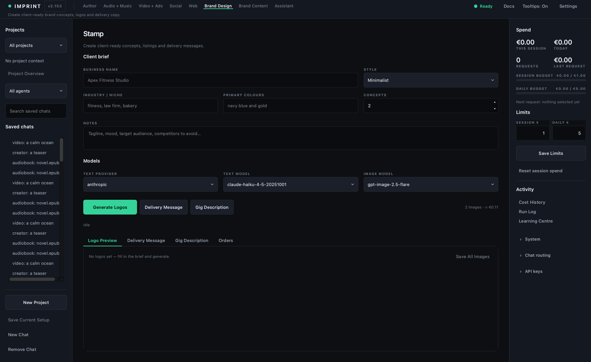

# Client Gigs

> **Outcome:** prepare one bounded client deliverable with explicit acceptance,
> revision, cost, and delivery boundaries.



## Prerequisites

- Written client brief, authorised source assets, delivery format, deadline,
  price/fees, revision count, and acceptance criteria.
- One project/order record for this engagement.

## Control atlas

| Area/tab | Purpose | Boundary |
|---|---|---|
| Brief and provider/model | Produces scoped concepts and copy | Generated interpretation does not amend client scope |
| Image model / logo generation | Creates visual concepts | Verify rights, spelling, dimensions, and brand fit |
| Logo Preview | Review the actual generated asset | Preview is not final delivery file by itself |
| Delivery Message | Drafts a concise handoff and usage notes | Never assert work/checks that were not performed |
| Gig Description | Drafts a marketplace listing | Claims, price, turnaround, and revisions must be truthful |
| Orders | Records business state | Add real fees, revisions, refunds, time, and acceptance externally if absent |
| Stop | Requests cancellation of the active local generation | Provider-accepted media may still incur cost |

## Worked run

1. Translate the client request into deliverable, inclusions, exclusions,
   required inputs, dimensions/formats, deadline, revisions, and approval owner.
2. Create a small concept set; do not spend for bulk variants before direction
   is approved.
3. Review the actual files at target sizes, on light/dark backgrounds, and for
   spelling, originality risk, artifacts, accessibility, and export correctness.
4. Create a Delivery Message that lists files, decisions, limits, and the next
   client action without fabricated checks.
5. Save the order/project and record real cost, correction/revision minutes,
   platform/payment fee, refund, and acceptance.

## How to read the output

Concept quality is not client acceptance. A sent proposal is not an order. An
invoice is not collected revenue. A delivered file is not accepted until the
agreed review state is observed.

## Acceptance checklist

- [ ] Brief and scope are confirmed before generation.
- [ ] Final files meet dimensions, formats, spelling, visual, and rights checks.
- [ ] Delivery copy truthfully describes the contents and remaining decisions.
- [ ] Revisions/refunds/fees/human time are captured in economics.
- [ ] Client approval and money movement remain human-controlled.

## Cost, cancellation, and gates

Include proposal time, provider runs, discarded concepts, corrections,
revisions, marketplace/payment fees, refunds, and support. Do not automate
scope acceptance, final delivery, disputes, or payments.

## Verification

Open each delivered file, match it to the signed-off scope/checklist, and record
the buyer's actual acceptance, revision, refund, and payment state.

## Common failures

**Endless variants:** request a direction decision against written criteria.  
**“Profitable” order:** include owner time and all fees before saying so.  
**Polished delivery message, wrong files:** verify the artifact independently.

## Done when

The client receives the verified scoped files, delivery record is accurate, and
the outcome/cost row can be used in the next service experiment.

## Next action

Measure it with [Unit economics](33-unit-economics.md) and decide whether the
workflow qualifies for [Automation maturity and review](36-automation-review.md).

## Recipe: deliver one client logo order

You will take one fictional client, *Golden Crumb Bakery*, from brief to
delivered order: two logo concepts, a delivery message, a gig listing, and a
durable order record that reloads with one click. Copy the example inputs
exactly the first time, then swap in a real client. Each **Show me** closes
this lesson, opens the control it names and rings it; **Back to lesson** in
the callout brings you back to that step.

**Time:** about 25 minutes, plus whatever the real client takes to respond.
**Cost:** up to three text requests — the image-prompt build, the delivery
message and the gig description — each shows its estimate and you approve it
before anything is sent (free with a local Ollama model); plus the logo
images, a second paid request billed per image through your OpenAI key. The
per-image price comes from `config/pricing.json`, sits beside **Generate
Logos**, and is approved the same way before any image is made.

### Step 1 — Write the client brief

Fill in the brief at the top of Client Gigs. Everything here is sent with
every request for this order, so the concepts and the copy describe the same
client.

```
Business name:     Golden Crumb Bakery
Industry / niche:  bakery
Primary colours:   warm brown and cream
Style:             Vintage
Concepts:          2
Notes:             family-run sourdough bakery; hand-drawn feel; wordmark
                   plus a simple wheat or loaf mark; avoid cursive that is
                   hard to read at small sizes.
```

Leave **Concepts** at 2 — do not pay for four variants before the client has
picked a direction.

[Show me](show:fiverr_name_input)

### Step 2 — Record the brand kit

The brand kit row holds per-client preferences that outlive this one order.

```
Brand fonts:  Recoleta headings, Source Sans body
Brand voice:  warm, plain-spoken, no exclamation marks
Brand rules:  logo must work in one colour; no gradients
```

The next time you type this client's name, Imprint fills their stored kit
into any field you left empty — anything you type yourself always wins.

[Show me](show:fiverr_brand_fonts_input)

### Step 3 — Choose the models

Pick a text provider and model; choose Ollama if you want the text requests
to stay on your Mac and cost nothing. The image model is a separate choice:
logo images are always made through OpenAI and need `OPENAI_API_KEY`,
whatever text provider you picked. Changing the image model or the concept
count updates the per-image estimate beside **Generate Logos** — read it
before the next step, because that is the number you will be approving.

[Show me](show:fiverr_image_model_box)

### Step 4 — Generate the concepts

Click **Generate Logos**. You approve two requests in turn: first the text
request that writes the image prompt, then the flat per-image cost for the
set. The status line narrates progress, **Stop** appears while a run is
active, and each concept lands in **Logo Preview** as it finishes. Imprint
also opens an order for this client automatically and logs the run.

**Good result:** the business name is spelled correctly, the mark reads at
small sizes, and it holds up on light and dark backgrounds. **Weak result:**
misspelled text or clip-art clutter — tighten the Notes and generate again,
knowing a re-run is a new paid request. A failed render releases the amount
that was authorised for it.

[Show me](show:fiverr_generate_btn)

### Step 5 — Review the files, then save them

In **Logo Preview**, hover a concept to see its file path. Check the actual
files, not your memory of them: spelling letter by letter, the target
dimensions, and both background colours. Click **Save All Images** to copy
the set to a folder you choose — your working files stay in Imprint's output
folder either way.

[Show me](show:fiverr_save_images_btn)

### Step 6 — Draft the delivery message

Click **Delivery Message**, approve the estimate, and watch the draft stream
into its tab. Then edit it until it is true: name only the files you are
actually sending, claim only the checks you performed in Step 5, and state
the remaining revision count and the next decision the client owns. The
edited text is attached to the order.

[Show me](show:fiverr_delivery_btn)

### Step 7 — Draft the gig listing

Click **Gig Description** and approve the estimate. The draft is a starting
point for a marketplace listing — the price, turnaround and revision count
in it are commitments you will have to keep, so replace them with numbers
you chose. Delete any line that promises income or results; what a gig earns
is not something this panel, or anyone, can predict.

[Show me](show:fiverr_gig_btn)

### Step 8 — Read back the order record

Open the **Orders** tab. The order from Step 4 lists its client, last update
and status, with every event logged along the way — logos requested and
delivered, delivery written, gig listing written. These rows are durable:
they survive a restart. Click the row and the whole record reloads into the
workspace — brief, brand kit, delivery message and gig text — ready for a
revision round weeks later. **Clear log** resets the visible workspace for
the next client; the saved rows stay. The money facts — marketplace fee,
refunds, the client's actual acceptance — happen outside Imprint, so record
them against the order yourself and treat them as self-reported until the
payout statement confirms them.

[Show me](show:fiverr_order_table)
