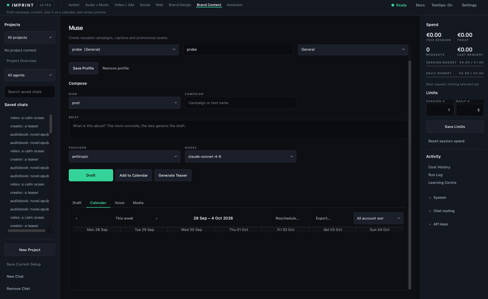

# Muse

> **Outcome:** create one campaign asset, keep public actions human-controlled,
> and land it on a plan you can act from.


## Prerequisites

- A content profile: a handle or project name and the platform or venture it
  is for.
- One bounded campaign idea, with an audience and an intended action.
- Rights to any likeness, voice or media you reference.

> Earnings, statement imports, account consent records, platform-policy review
> and the agency view moved to **Backstage** on 30 September 2026. Muse is the
> production surface; Backstage is where the money and the account
> authorisation records live. Nothing here reports revenue any more.

## Profile and compose controls

| Control | Meaning |
|---|---|
| Profile / Handle / Platform | Durable account or project identity and destination context |
| Save Profile / Remove profile | Persist or remove profile state |
| Kind | post, caption, campaign, posting_plan, promo_assets, hooks, bio, promo |
| Campaign | Label every asset for later comparison |
| Channel | Appears for `promo` only — the off-platform funnel the post is written for |
| Brief / Provider / Model / Draft | Bounded content request and local Best Fit route |
| Add to Calendar | Saves reviewed output as a prepared schedule item |
| Teaser route / Generate/Cancel Teaser | Paid SFW promotional render from Higgsfield Seedance 2.5, Gemini Omni 1.1 Flash or Qwen Wan 3.0; Cancel applies to Higgsfield only |
| Stop | Stops active text generation locally where possible |

## Four output tabs



| Tab | How to use it |
|---|---|
| Draft | Editable output. Nothing is sent automatically; review then post manually. |
| Calendar | A seven-day grid with an Undated lane, rescheduling, and `.ics` / CSV export. Prepared state is not published state. |
| Voice | Manage voice and character settings, and test samples before use. |
| Media | Add Media with kind, source, caption, and rights/provenance. |

## Worked run

1. Select or create a profile and save it.
2. Choose one Kind and a brief with audience, offer, proof boundary, CTA, and
   prohibited claims. For a `promo`, pick the channel it is written for.
3. Draft once. Review voice, facts, platform fit, and CTA.
4. Add the approved item to Calendar; do not imply it was posted. Use
   Reschedule to give an undated item its first real date.
5. Add only media and voice references you hold rights to, with provenance.
6. For a teaser, confirm SFW content, estimate, provider policy, likeness
   rights, and the cancellation boundary before submission.
7. Export the week as `.ics` or CSV if you work the plan somewhere else.

## Characters

An account may carry a written character — appearance, backstory, personality,
boundaries, a locked generation seed and reference images. It exists so
successive drafts and teaser renders are the same character rather than a new
one each time. It is a consistency tool, not a claim that the character is a
real person, and Muse will not write copy asserting that it is.

## How to read the output

Draft, calendar and media counts are production observations, not results.
A calendar item's status describes what Imprint knows: `draft` means prepared
here, never that anything was posted. Verification is manual and belongs to
you — confirm publication on the platform itself before treating an item as
live, and read receipts and revenue in Backstage, which holds the statements
and their source and window.

## Acceptance checklist

- [ ] No impersonation, unauthorised likeness or voice, private material, or false claim.
- [ ] Public interaction and posting remain human-controlled.
- [ ] Calendar status describes reality: prepared is not posted.
- [ ] The content links to one measurable intended action.

## Cost, cancellation, and gates

Include text and media generation, retries, production, moderation, promotion,
and human time. Every teaser is assessed across the three routes before
approval; Higgsfield, priced only by its own estimate, is never recommended on
a guess. Cancel Teaser can fail after Higgsfield accepts a render and is not
offered for Omni or Wan; preserve and save a paid result rather than submitting
duplicates. Imprint records its own generation cost in EUR against the calendar
item.

## Common failures

**Channel disappeared:** it applies to the `promo` kind only; conditional
fields give up their cell rather than leaving a hole.  
**No posting button:** Muse intentionally produces drafts; a human publishes.  
**Looking for Earnings:** it is in Backstage now, along with statement imports
and the agency view.

## Done when

The asset passes the safeguards, the prepared state is honest, and the plan
says what you will actually do.

## Next action

For measurement, create an [evidence passport](30-evidence.md).

## Recipe: plan and draft one post, start to finish

You will plan and draft one piece of content — a launch post for the
cosy-mystery novella *The Lantern Route*, filed under the campaign
`lantern-launch` — and land it on the week plan with a real date and an
exported `.ics`. Copy the example inputs exactly the first time, then swap in
your own. Each **Show me** closes this lesson, opens the control it names and
rings it; **Back to lesson** in the callout brings you back to that step.

**Time:** about 25 minutes. **Cost:** one text request in Imprint — you see its
estimate and approve it before anything is sent. The optional teaser in Step 8
is a separate paid render on the route you choose: Higgsfield shows its exact
price first, while Gemini Omni and Wan 3.0 are priced from Imprint's per-second
rates — about $0.50 for the 5-second clip. Nothing is generated until you
approve it. Skip Step 8 and there is no teaser cost. Imprint records its own
generation spend in EUR against the calendar item; receipts and revenue live in
Backstage, and nothing in this recipe predicts what the post will earn.

### Step 1 — Create the content profile

Fill in the profile fields at the top of Muse and click **Save Profile**. The
handle and platform travel with every draft, so the copy fits the same
account each time. The profile exists only inside Imprint — saving or
removing it touches nothing on the platform, and account consent records
live in Backstage, not here.

```
Handle / project:    @lanternpress
Platform / venture:  Writing / Publishing
```

[Show me](show:creator_handle_input)

### Step 2 — Teach it the voice

Open the **Voice** tab and paste five or six of this account's own posts —
the model imitates these, and it is what stops drafts reading like generic
AI copy. Fill the four small fields, then click **Save Voice & Character**.
On a persona account the Character bible appears below: appearance,
backstory, personality, boundaries and a locked seed keep every draft and
render the same character.

```
Tone:       dry, warm, a bit deadpan
Emoji:      sparse — one at most
Length:     1–2 short sentences
Never say:  babe, hun, limited time only
```

[Show me](show:creator_voice_samples)

### Step 3 — Say what this one is

Back in **Compose**, pick the kind, name the campaign, and write the brief.
Channel only appears when the kind is `promo` — for a plain post the row
closes up without it. The brief is what makes the draft yours: audience,
offer, one intended action, and what it must never claim.

```
Kind:      post
Campaign:  lantern-launch
```

```
Announce that "The Lantern Route", a cosy small-town mystery novella, is out
on 19 October. Audience: cosy-mystery readers, 30–60, who finish a book a
week. Offer: pre-order link in bio. CTA: one action — tap the link and
pre-order. Proof boundary: quote only the two review lines we actually have.
Never say: bestseller, #1, "readers are calling it", or anything about
earnings.
```

[Show me](show:creator_brief_input)

### Step 4 — Draft it

Pick a provider and model — **BEST FIT** marks the recommended route for
this task; any model that writes well is fine. Click **Draft**. Imprint
shows the estimate; approve it. While it runs, **Stop** cancels locally
where possible. The result lands in the **Draft** tab, fully editable, and
is sent nowhere — the status line says exactly that: review before posting.

**Good result:** it reads like your samples, makes one ask, and claims
nothing outside the proof boundary. **Weak result:** generic copy — add more
voice samples; or invented praise — tighten "Never say" and draft again.

[Show me](show:creator_generate_btn)

### Step 5 — Put it on the plan

Edit the draft until you would actually post it, then click **Add to
Calendar**. The dialog asks when — nothing posts itself; this is your own
plan. Tick **No date yet** this first time: the item lands in the Undated
list with status `draft`, which means prepared in Imprint, never that
anything was published. Keep the same profile selected — a draft made for
one profile will not schedule under another.

[Show me](show:creator_schedule_btn)

### Step 6 — Give it its first real date

The **Calendar** tab is a seven-day grid with the Undated list beneath it.
Select your item there and click **Reschedule…** (double-clicking it works
too), then pick a date and time — or tick **Whole day** if you have not
chosen a time; the grid shows a dash rather than inventing midnight. The
view jumps to the week that now holds the item, and the week buttons move
you back and forth from there.

[Show me](show:creator_calendar_reschedule_btn)

### Step 7 — Export the week

Click **Export…** to work the plan somewhere else: `.ics` writes the dated
items for your calendar app and tells you how many undated items it skipped
(use CSV for those); CSV writes everything. The export is your plan, not a
record of publication — confirm on the platform itself before treating
anything as live.

[Show me](show:creator_calendar_export_btn)

### Step 8 — Optional: render a teaser

With the calendar item still selected — the finished render attaches to it —
pick a route in the menu beside **Generate Teaser**: Higgsfield · Seedance
2.5, Gemini · Omni 1.1 Flash or Qwen · Wan 3.0. Each uses the character's
reference images (Omni takes up to three, Wan up to ten); Omni and Wan make a
5-second vertical clip. The route needs its provider's keys in Imprint's
private `.env` and its permission enabled in the API permissions row, and
you need rights to any likeness or reference image it uses. Then click
**Generate Teaser**. On Higgsfield the prompt must pass the SFW check, and
Imprint fetches Higgsfield's estimate and shows the exact price in dollars
and credits. The approval also ranks the three routes for this teaser; if
another wins by at least a point, **Apply** switches to it and asks again. No
paid generation starts until you approve. The file is saved into the
**Media** tab with its source and job id.

**Cancel Teaser** is honest about its limits: on Higgsfield it cancels
cleanly during preparation, but once rendering has begun Higgsfield may
finish and charge, and Imprint saves the paid result rather than inviting a
duplicate. An Omni or Wan teaser cannot be cancelled once submitted. If you
quit mid-render, the next launch resumes a Higgsfield job or a Wan task and
saves it; an Omni render has nothing to look up afterwards, so it is marked
lost and shown to you rather than billed on a guess — check the provider's
own dashboard for it.

[Show me](show:creator_video_btn)
